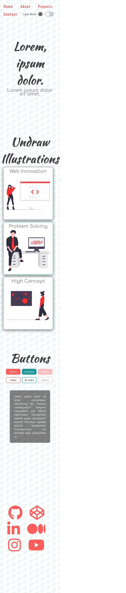
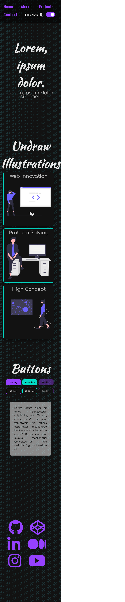
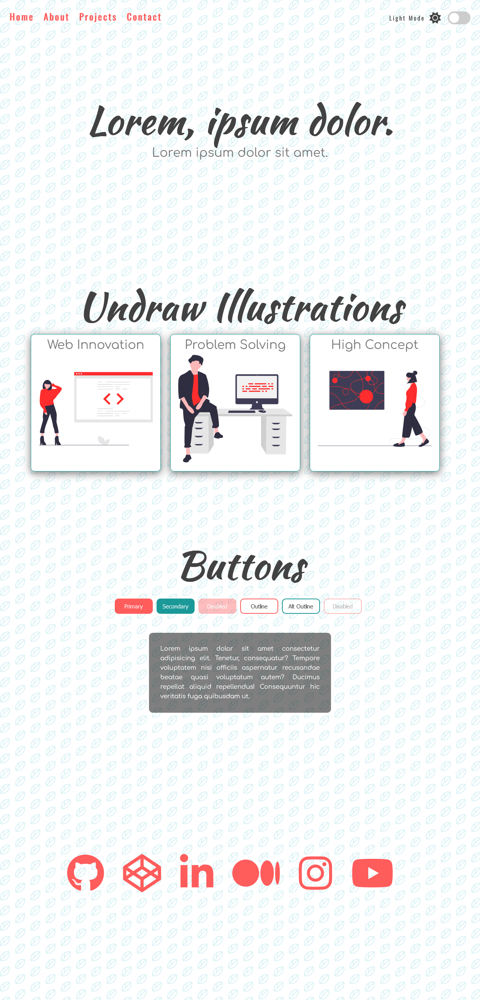
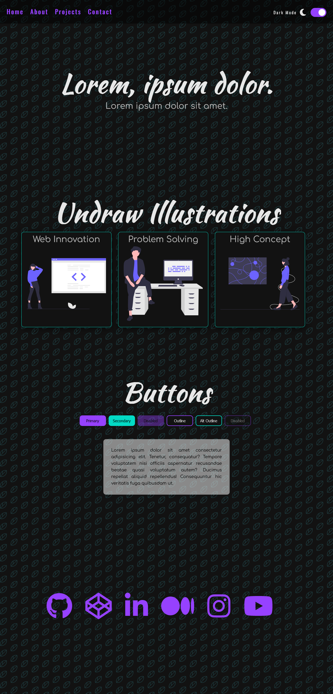

# Light & Dark Mode
This is a small project to build a simple page that user can switch to light mode or dark mode and store the user preferences in local storage.

## Table of contents

- [Overview](#overview)
  - [The project](#the-project)
  - [Screenshot](#screenshot)
  - [Links](#links)
- [My process](#my-process)
  - [Built with](#built-with)
  - [What I learned](#what-i-learned)
  - [Useful resources](#useful-resources)
- [Author](#author)

## Overview

### The project

Users should be able to:

- Switch to light mode and dark mode
- See their last chosen mode when they revisit the page in the future

### Screenshot

#### Mobile preview

##### Light Mode


##### Dark Mode


#### Desktop preview

##### Light Mode


##### Dark Mode


### Links

- [Github repo](https://github.com/nurmarief/light-mode-dark-mode/)
- [Live site](https://nurmarief.github.io/light-mode-dark-mode/)

## My process

### Built with

- Semantic HTML5 markup
- BEM architecture for CSS
- Mobile-first workflow

### What I Learned

In this project I learn how to create light mode & dark mode feature, including:

1. How to create slider-switch UI
2. How to manage light mode and dark mode color palette
3. How to check user system theme preference using ```matchmedia``` api
```
window.matchMedia && window.matchMedia('(prefers-color-scheme: dark)').matches
```

### Useful resources

- [fontawesome](https://www.fontawesome.com/)
- [google fonts](https://www.fonts.google.com/)
- [undraw](https://undraw.co/illustrations/)
- [heropatterns](https://www.heropatterns.com/)

## Author

- [nurmarief](https://github.com/nurmarief)